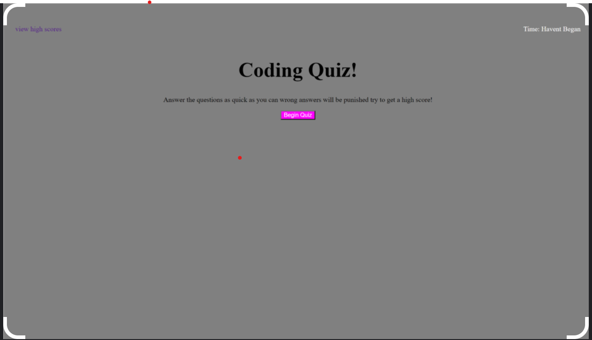

<h1>Coding Quiz</h1>
<h2>Description</h2>
    
The purpose of this quiz is to create a quiz that saves the high scores of the user taking the quiz locally and have multiple questions that come together using a countdown to factor a score based on performance, speed and how many questions were answered correctly.

<h2>Screenshot of the Landing Page for the Coding Quiz</h2>

 The application is divided into four parts the index.html contains all of the body and div's used to create the landing page and questions/answer validation remarks throughout the quiz behing handled by script.js, then to keep the coding clean there is a seperate js file handing the highscores.html and saving the local data.

<h2>Contributors</h2>

Chris McLeod

<h2>Languaged Used</h2>

html

CSS

Javascript

<h2>Deployable Link</h2>
https://chris-mcleod2.github.io/codingquiz/index.html 
<h2>Github Link</h2>
https://github.com/Chris-McLeod2/codingquiz.git 